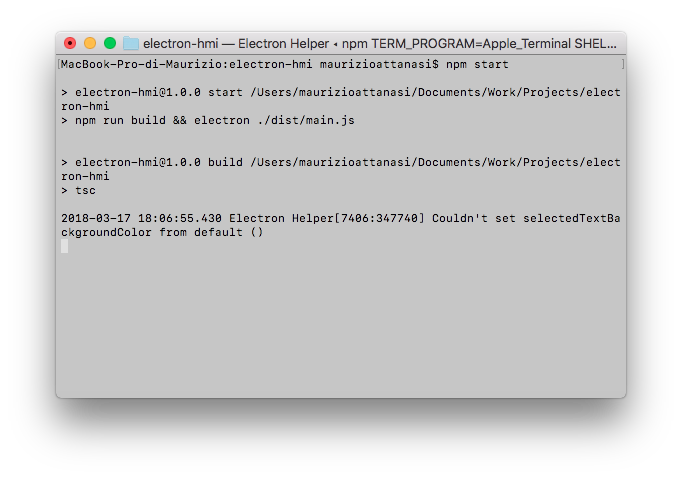
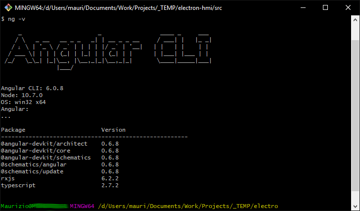
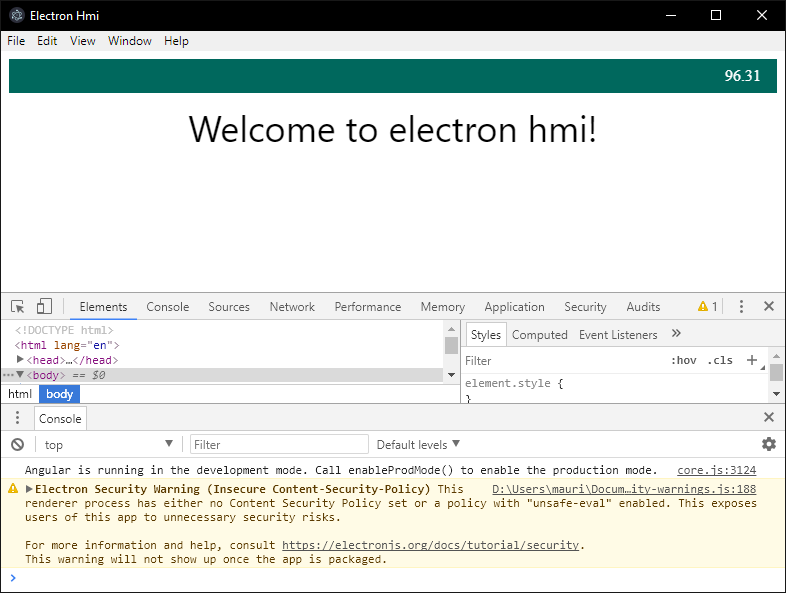
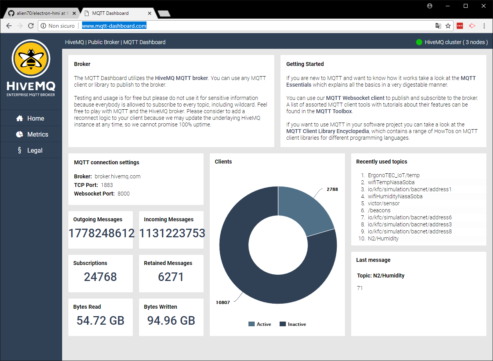

# electron-hmi

Demonstration project to explore the possibilities offered by multiplatform technologies such as node.js, typescript and electron, in **H**uman **M**achine **I**nterfaces (HMI) development.

## Foreward

As an engineer involved in the last two decades in design and development of complex systems in different fields such as Industrial Automation, Internet Of Things, and lately in Virtual/Augmented Reality aided Training Systems, one of the tasks to face with is the development of different HMI clients to allow the interaction between the end user and the above mentioned systems.

This note, and the attached project, is aimed to identify a set of technologies that will allow the realization of those interfaces independently, as far as possible, from the hardware and operating system platform on which they are intended to run. Independency, in my humble opinion, is, and will be, a key concept, that will allow system engineers to scale all the components to the real needs and to the budget available to accomplish the requirements of a project.

Among all the different techonologies available on the market nowadays, the only ecosystem that is really cross platform is the one centered on the [javascript](https://www.javascript.com/) programming language. Neither Java or .NET are capable of such a capillary diffusion natively. The language once used only for client applications running in a browser, thanks technologies like [Node.js](https://nodejs.org/) make its use allowed server side also. There's a lot of tools and libraries borrowed from the Web Applications field that make the implementation of appealing user interfaces really simple. Boxing all this stuff in a desktop application runnable on **Windows**, **Linux** or even **macOS**, is really straightforward with frameworks such as [electronjs](https://electronjs.org/).

The only *caveat* toward the use of plain javascript for large applications is in the nature of javascript itself or in the fact of being a loosely typed programming language. This fact made me, and many other *old style* programmers I suspect, suspicious respect the use of this idoma, but when I first read about [**Type**Script](https://www.typescriptlang.org/), a superset of Javascritpt introduced by Microsoft, that introduces **types** in JS, I felt very curious, and, a I always do with those kind of things, I began to study, and to search for some tools that hopefully will allow me to achieve the target that is to implement an HMI capable to connect and communicate over some channels and to run on my macbook, on a Windows pc/laptop and also on a tiny [Raspbery Pi](https://www.raspberrypi.org/).

## Development workstation setup

Let's begin preparing to necessary to build do our application. To prove that the final product is really cross platform I will use a Macbook Pro with **macOS** *High Sierra* ver. 10.3.3 as my main development machine and a Windows 10 Pro laptop and an Ubuntu Server 16.04 LTS machine to repackage and test the resulting application.

To install all the necessary packages and frameworks I'll make use of package managers, and, in detail:

- [Homebrew](https://brew.sh/) on macOS;
- [Chocolatey](https://chocolatey.org/) on Windows;
- [Advanced Packaging Tool](https://it.wikipedia.org/wiki/Advanced_Packaging_Tool)  a.k.a. **apt** on Ubuntu;

### Node.js

First of all we need to have node.js, the javascript runtime, installed on development machines. I prefer using an LTS version, that, at the time of writing is **8.9.4 LTS**. We can download the installer for the desired os from the node.js [site](https://nodejs.org/), or we can use the above mentioned package managers.

On macOS, on a terminal we'll issue the command

```cmd
MacBook-Pro-di-Maurizio:/ maurizioattanasi$  brew install node@8
```

which will download and install the latest release of version 8. After the installation process terminates, on the same command line we'll state the following command:

On a Windows system, with Chocolatey installed, on a command prompt, we'll use the command:

```cmd
C:\> choco install nodejs-lts
````

On Debian/Ubuntu machines, we'll use:

```cmd
m***@m***-server:~$ apt-get install -y nodejs
```

#### Node installation check

After the installation process, on a command promp (or Terminal), we'll issue the command *node -v* to check the current version of node, and *npm -v*, to check the current version of npm.

```cmd
MacBook-Pro-di-Maurizio:/ maurizioattanasi$ node -v
v8.9.4
```

that tells us that we have installed the desired version. As a side effect of installing node.js, we have also at our disposal the **Node Package Manager* a.k.a. npm. To check the npm version, on the terminal, we'll issue:

```cmd
MacBook-Pro-di-Maurizio:/ maurizioattanasi$ npm -v
5.6.0
```

### TypeScript

By installing TypeScript we mean the TypeScript compiler, named **tsc** that is the main component needed to compile TypeScript code into plain JavaScritpt. Having *npm* installed on our development machines, this step is quite straightforward. On a command prompt, or a terminal, simply type:

```cmd
MacBook-Pro-di-Maurizio:/ maurizioattanasi$ npm install -g typescript
```

then hit enter. After completion we'll have tsc, the TypeScript compiler, installed globally (-g switch applyed to the npm command). To check the version installed, as usal, type:

```cmd
MacBook-Pro-di-Maurizio:~ maurizioattanasi$ tsc -v
Version 2.6.2
```

Perfect! We have **node.js version 8.9.4**,  **npm version 5.6.0** and **TypeScript version 2.6.2** installed on our machine. From now on we only need a text editor, one with which we feel at ease, and we can start writing down some code.

## Project setup

To start a node project we'll use npm again:

```cmd
maurizioattanasi$ npm init -y
```

that will result in a *package.json* file which content will be similar to:

```json
{
  "name": "electron-hmi",
  "version": "1.0.0",
  "description": "Demonstration project to explore the possibilities offered by multiplatform technologies such as node.js, typescript and electron, in **H**uman **M**achine **I**nterfaces (HMI) development.",
  "main": "index.js",
  "scripts": {
    "test": "echo \"Error: no test specified\" && exit 1"
  },
  "repository": {
    "type": "git",
    "url": "git+https://github.com/alien70/electron-hmi.git"
  },
  "keywords": [],
  "author": "",
  "license": "MIT",
  "bugs": {
    "url": "https://github.com/alien70/electron-hmi/issues"
  },
  "homepage": "https://github.com/alien70/electron-hmi#readme"
}
```

### electronjs setup

Following the instructions on the npm page for [electron](https://www.npmjs.com/package/electron), on the terminal:

```cmd
maurizioattanasi$ npm install electron --save-dev --save-exact
````

or

```cmd
maurizioattanasi$ npm i electron -D -E
```

at the end we'll have the **package.json** file

```json
  "devDependencies": {
    "electron": "1.8.2"
  }
```

### First electron app... The JavaScritp way

``` html
<tldr></tldr>
````

Following the electron tutorial [Writing Your First Electron App
](https://electronjs.org/docs/tutorial/first-app#writing-your-first-electron-app), we'll create a main.js file and a index.html file and we'll modify the **package.json** as follow:

```json
...
  "main": "main.js",
  "scripts": {
    "start": "electron ."
  },
...
```

Now we can try our application running...

```cmd
maurizioattanasi$ npm start
```

...and, here we have our first web based desktop application.


The next step is to replace the JavaScript code with TypeScript.

### Let' add some TypeScript

The first step is to rearrange our project in order to introduce TypeScript.

- First thing first, we'll create a new folder named _src_ wich will contain our TypeScript source files;
- Then let's rename our JavaScript files changing their extensions from _js_ to _ts_, and move them from the root folder to the _src_ folder. The content of the files will not change much, after all __TypeScript__ is a superset of __JavaScript__. Infact the only thing that we'll change are the _const_ and _let_ declarators that, in the spirit of the new idioma will become _var_;
- Another change in the _main.ts_ file is the relative path of the _index.html_ file that will change into

```typescript
'../index.html'
```

- A major change is the introduction of the _tsconfig.json_ file in the root of our project which specifies the root files and the compiler options required to build the project.

```json
{
    "compilerOptions": {
      "target": "es5",
      "module": "commonjs",
      "moduleResolution": "node",
      "noImplicitAny": false,
      "sourceMap": true,
      "outDir": "dist",
      "baseUrl": ".",
      "paths": {
        "*": [
          "node_modules/*"
        ]
      }
    },
    "include": [
      "src/**/*"
    ]
  }
```

- Finally, we have to add some changes to our _packag.json_ file, and in particular, we'll add a _build_ script that will invoke our __TypeScript__ compiler _tsc_

```json
"build": "tsc",
```

and then we need to modify a little our _start_ script as follows:

```json
"start": "npm run build && electron ./dist/main.js"
```

so that, in a few words, it will initially compile our __TypeScript__ project, and then launch the  application passing to the __electron__ command the resulting _main.js_ file.



## And finally Angular + Mqtt

To achieve the desired result, we will rearrange our project in order to display some dynamic readings.

## Let's go Angular

Let's introduce [Angular](https://angular.io/) framework to add order and development speed to our simple project, and we'll do this using [Angular CLI](https://cli.angular.io/).

First thing first, we need to install the CLI if we haven't done yet.

``` cmd
> npm install -g @angular/cli
```

After this step, we'll check the installed version of the cli issuing the command:

``` cmd
> ng -v
```



### Crete the angular project

To create our angular project using the installed CLI, we'll use the command

``` cmd
> ng new electron-hmi
```

At the end of the process, step into the newly created folder and try the result typing the command

``` cmd
> ng serve
```

Opening our favourite browser on [http://localhost:4200/]() we will see our brand new Angular single page application running.

### Electron

Since our main goal is to implement a desktop application, we'll add electron to our project the same way we did in our previous project.

The only _caveat_ we have to attention to let the [Electron]() _main.js_ application script point to the right [index.hmtl]() file.

In our previous implementations, we used the following piece of code to pass the _url_ to the electron application script:

``` javascript
  win.loadURL(url.format({
    pathname: path.join(__dirname, 'dist', 'index.html'),
    protocol: 'file:',
    slashes: true
  }))
```

To maintain this path, we have to the following change in our _angular.json_ configuration file.

``` json
...

 "architect": {
        "build": {
          "builder": "@angular-devkit/build-angular:browser",
          "options": {
            "outputPath": "dist/electron-hmi",
            
...            
```

to

``` json
...

 "architect": {
        "build": {
          "builder": "@angular-devkit/build-angular:browser",
          "options": {
            "outputPath": "dist",

...            
```

To run our new _electron_ app we need to add the appropriate scripts to the _package.json_ configuration file

``` json
  "main": "main.js",
  "scripts": {
    ...
    "electron": "ng build && electron .",
    "electron-aot": "ng build --aot && electron ."
  },
```

that will build our _angular_ SPA application into our _dist_ folder, and then run electron.

Running the command

``` cmd
> npm run electron
```

will open our desktop application.

[](https://youtu.be/gsuCieX2yk8)

__Note:__ the image above is linked to a youtube video

### Live data streaming

- To add some live data I made use of a public __mqtt__ reading available at [MQTT Dashboard](http://www.mqtt-dashboard.com/)

[](http://www.mqtt-dashboard.com/)

- To stream the data into our angular application, I used [ngx-mqtt](https://www.npmjs.com/package/ngx-mqtt) node package;

- The gauge is implemented [ngx-gauge](https://www.npmjs.com/package/ngx-gauge) node module;

That's all for now.
